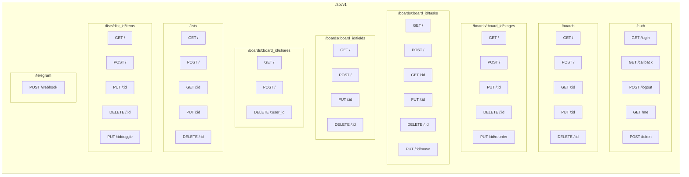
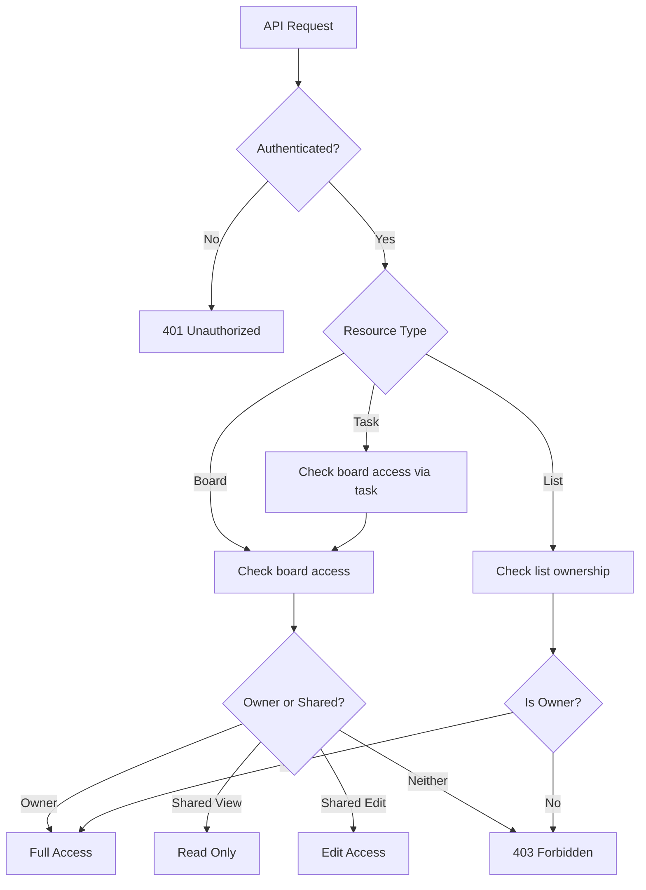

# API Structure

> **Status:** ✅ APPROVED  
> **Prepared by:** Parker (Architect/Diagrammer)  
> **Date:** 2026-02-27

## API Endpoint Groups



## Endpoint Reference

### Authentication (`/api/v1/auth`)

| Method | Endpoint | Description | Auth |
|--------|----------|-------------|------|
| GET | `/login` | Redirect to Google OAuth | ❌ |
| GET | `/callback` | OAuth callback handler | ❌ |
| POST | `/logout` | End session | ✅ |
| GET | `/me` | Get current user info | ✅ |
| POST | `/token` | Generate JWT for API access | ✅ |

### Boards (`/api/v1/boards`)

| Method | Endpoint | Description | Auth |
|--------|----------|-------------|------|
| GET | `/` | List user's boards (owned + shared) | ✅ |
| POST | `/` | Create new board | ✅ |
| GET | `/:id` | Get board details | ✅ |
| PUT | `/:id` | Update board | ✅ |
| DELETE | `/:id` | Delete board | ✅ |

### Stages (`/api/v1/boards/:board_id/stages`)

| Method | Endpoint | Description | Auth |
|--------|----------|-------------|------|
| GET | `/` | List stages in board | ✅ |
| POST | `/` | Create new stage | ✅ |
| PUT | `/:id` | Update stage | ✅ |
| DELETE | `/:id` | Delete stage | ✅ |
| PUT | `/:id/reorder` | Change stage position | ✅ |

### Tasks (`/api/v1/boards/:board_id/tasks`)

| Method | Endpoint | Description | Auth |
|--------|----------|-------------|------|
| GET | `/` | List tasks (optional: ?stage_id=) | ✅ |
| POST | `/` | Create new task | ✅ |
| GET | `/:id` | Get task details | ✅ |
| PUT | `/:id` | Update task | ✅ |
| DELETE | `/:id` | Delete task | ✅ |
| PUT | `/:id/move` | Move task to different stage | ✅ |

### Custom Fields (`/api/v1/boards/:board_id/fields`)

| Method | Endpoint | Description | Auth |
|--------|----------|-------------|------|
| GET | `/` | List custom field definitions | ✅ |
| POST | `/` | Create new field definition | ✅ |
| PUT | `/:id` | Update field definition | ✅ |
| DELETE | `/:id` | Delete field definition | ✅ |

### Sharing (`/api/v1/boards/:board_id/shares`)

| Method | Endpoint | Description | Auth |
|--------|----------|-------------|------|
| GET | `/` | List users board is shared with | ✅ |
| POST | `/` | Share board with user (by email) | ✅ |
| DELETE | `/:user_id` | Remove user's access | ✅ |

### Lists (`/api/v1/lists`)

| Method | Endpoint | Description | Auth |
|--------|----------|-------------|------|
| GET | `/` | List user's standalone lists | ✅ |
| POST | `/` | Create new list | ✅ |
| GET | `/:id` | Get list with items | ✅ |
| PUT | `/:id` | Update list | ✅ |
| DELETE | `/:id` | Delete list | ✅ |

### List Items (`/api/v1/lists/:list_id/items`)

| Method | Endpoint | Description | Auth |
|--------|----------|-------------|------|
| GET | `/` | List items in list | ✅ |
| POST | `/` | Add item to list | ✅ |
| PUT | `/:id` | Update item | ✅ |
| DELETE | `/:id` | Delete item | ✅ |
| PUT | `/:id/toggle` | Toggle checkbox | ✅ |

### Telegram (`/api/v1/telegram`)

| Method | Endpoint | Description | Auth |
|--------|----------|-------------|------|
| POST | `/webhook` | Telegram webhook handler | Telegram signature |

## Response Formats

### Success Response
```json
{
  "data": { ... },
  "meta": {
    "total": 10,
    "page": 1,
    "per_page": 20
  }
}
```

### Error Response
```json
{
  "error": {
    "code": "VALIDATION_ERROR",
    "message": "Title is required",
    "details": { "field": "title" }
  }
}
```

## Authorization Model


