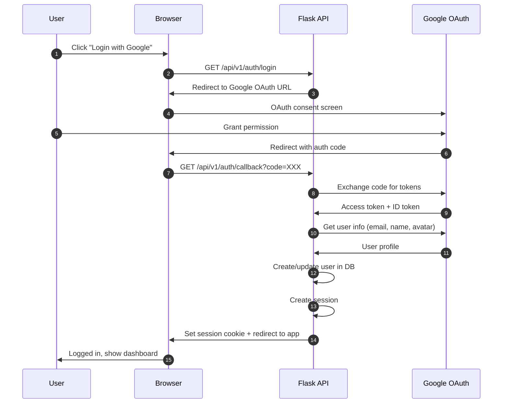
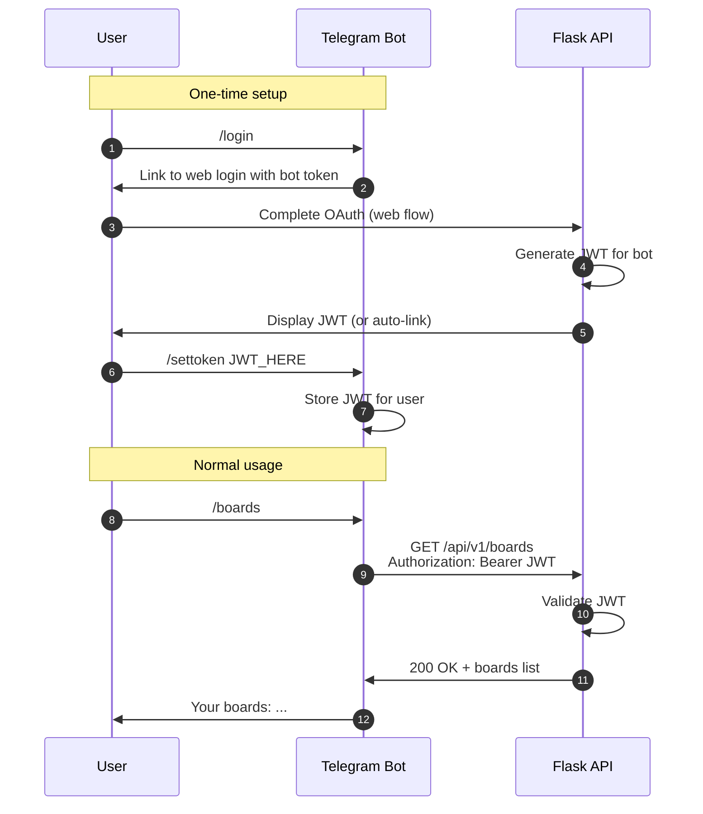
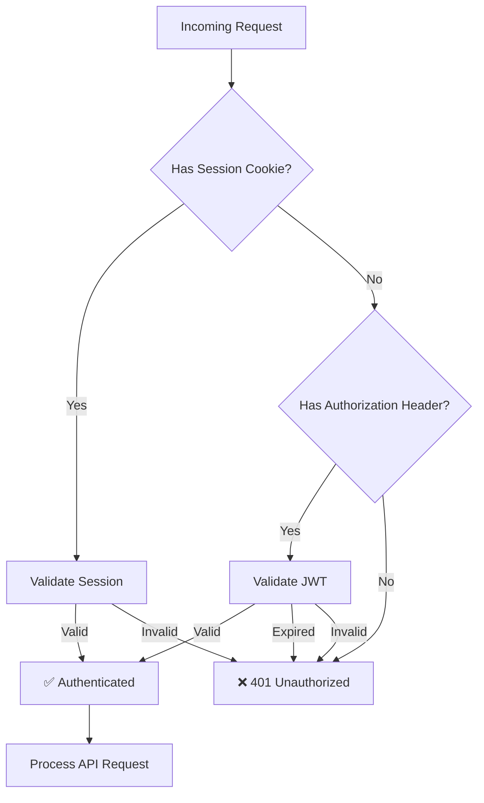

# Authentication Flow

> **Status:** ✅ APPROVED  
> **Prepared by:** Parker (Architect/Diagrammer)  
> **Date:** 2026-02-27

## Gmail OAuth Flow (Web)



## JWT Token Flow (API/Telegram Bot)



## Session vs JWT Decision Points



## Token Contents

### Session (stored server-side)
```json
{
  "user_id": 123,
  "email": "saba@gmail.com",
  "created_at": "2026-02-27T10:00:00Z"
}
```

### JWT (stateless, in token)
```json
{
  "sub": 123,
  "email": "saba@gmail.com",
  "iat": 1740672000,
  "exp": 1743264000
}
```

## Security Considerations

| Aspect | Session | JWT |
|--------|---------|-----|
| Storage | Server-side (file/memory) | Client-side |
| Cookie flags | HttpOnly, Secure, SameSite=Lax | N/A (header) |
| Expiration | Server controls | Token expiry claim |
| Revocation | Delete session | Requires blocklist or short expiry |
| Use case | Web browser | API clients, Telegram bot |
