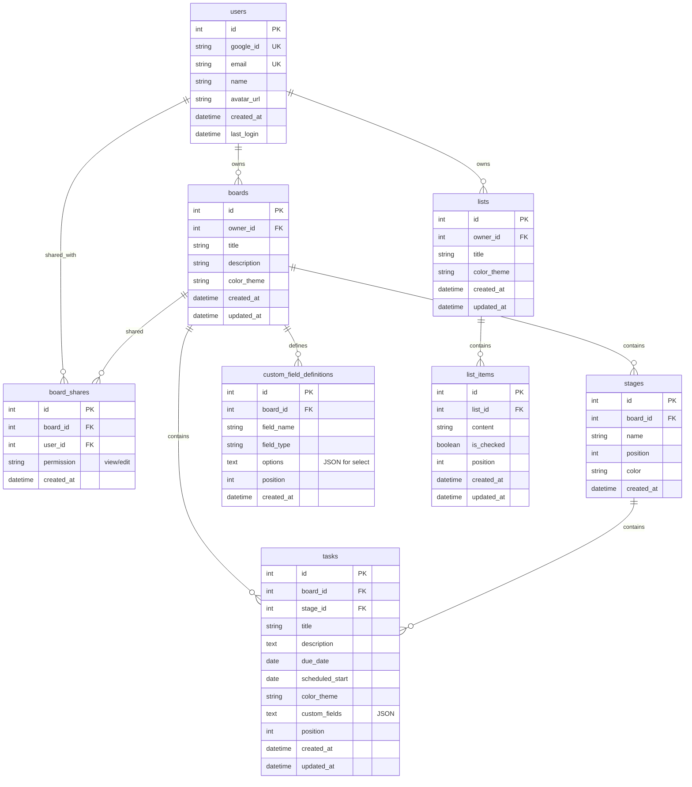

# Database Entity Relationship Diagram

> **Status:** ✅ APPROVED  
> **Prepared by:** Parker (Architect/Diagrammer)  
> **Date:** 2026-02-27

## Entity Relationship Diagram

## Entity Descriptions

### Core Entities

| Entity | Purpose |
|--------|---------|
| **users** | Gmail-authenticated users. Each user has isolated data. |
| **boards** | Projects/workspaces. Owned by a user, can be shared. |
| **stages** | Workflow columns within a board (To Do, In Progress, Done). |
| **tasks** | Work items within boards, assigned to stages. |

### Supporting Entities

| Entity | Purpose |
|--------|---------|
| **custom_field_definitions** | Schema for custom fields per board. |
| **board_shares** | Many-to-many relationship for collaboration. |
| **lists** | Standalone checklists (shopping, grocery, etc.). |
| **list_items** | Individual checkbox items within lists. |

## Key Relationships

- A **user** can own many **boards** and **lists**
- A **board** contains multiple **stages** (default: To Do, In Progress, Done)
- A **board** can define multiple **custom_field_definitions**
- A **task** belongs to one **board** and one **stage**
- A **task** stores custom field values as JSON (validated against definitions)
- A **board** can be shared with multiple **users** via **board_shares**
- A **list** contains multiple **list_items** (checkboxes)

## Notes

- `custom_fields` in tasks is a JSON column storing user-defined field values
- `custom_field_definitions` provides the schema for validation and UI rendering
- This follows the **hybrid approach** proposed in the architecture decisions
