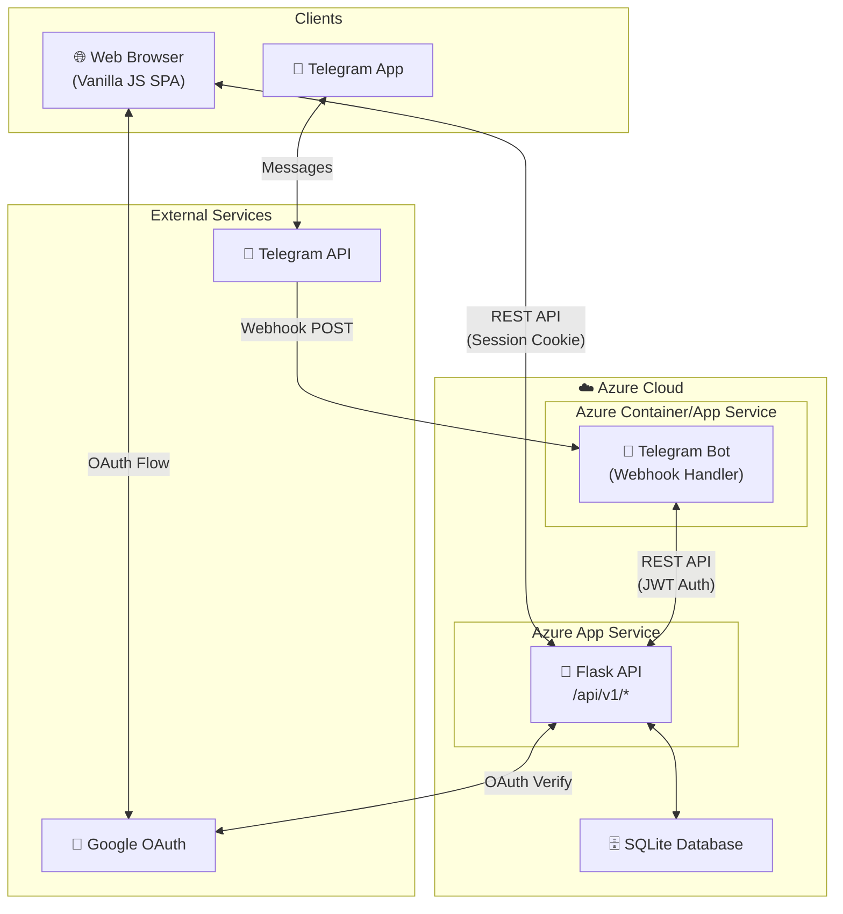

# System Architecture Overview

> **Status:** ✅ APPROVED  
> **Prepared by:** Parker (Architect/Diagrammer)  
> **Date:** 2026-02-27

## High-Level System Architecture



## Component Responsibilities

| Component | Responsibility |
|-----------|----------------|
| **Web Browser (SPA)** | User interface, client-side routing, API calls |
| **Flask API** | REST endpoints, authentication, business logic, data access |
| **SQLite Database** | Persistent storage for all data |
| **Telegram Bot** | Chat interface, command handling, API client |
| **Google OAuth** | User authentication via Gmail |
| **Telegram API** | Message delivery, webhook management |

## Data Flow Patterns

### Web User Flow
```
Browser → Flask API → SQLite → Flask API → Browser
```

### Telegram User Flow
```
Telegram App → Telegram API → Bot Webhook → Flask API → SQLite → ... → Bot → Telegram API → Telegram App
```

### Authentication Flow
```
Browser → Google OAuth → Flask API (verify + create session) → Browser (receives cookie + optional JWT)
```
