# System Architecture Overview

> **Status:** ✅ APPROVED  
> **Prepared by:** Parker (Architect/Diagrammer)  
> **Date:** 2026-02-27

## High-Level System Architecture

```mermaid
flowchart TB
    subgraph Clients
        Browser["🌐 Web Browser<br/>(Vanilla JS SPA)"]
        TelegramApp["📱 Telegram App"]
    end

    subgraph External Services
        Google["🔐 Google OAuth"]
        TelegramAPI["📡 Telegram API"]
    end

    subgraph Azure["☁️ Azure Cloud"]
        subgraph AppService["Azure App Service"]
            FlaskAPI["🐍 Flask API<br/>/api/v1/*"]
        end
        
        subgraph BotService["Azure Container/App Service"]
            TelegramBot["🤖 Telegram Bot<br/>(Webhook Handler)"]
        end
        
        SQLite["🗄️ SQLite Database"]
    end

    Browser <-->|"REST API<br/>(Session Cookie)"| FlaskAPI
    Browser <-->|"OAuth Flow"| Google
    
    TelegramApp <-->|"Messages"| TelegramAPI
    TelegramAPI -->|"Webhook POST"| TelegramBot
    TelegramBot <-->|"REST API<br/>(JWT Auth)"| FlaskAPI
    
    FlaskAPI <-->|"OAuth Verify"| Google
    FlaskAPI <--> SQLite
```



## Component Responsibilities

| Component | Responsibility |
|-----------|----------------|
| **Web Browser (SPA)** | User interface, client-side routing, API calls |
| **Flask API** | REST endpoints, authentication, business logic, data access |
| **SQLite Database** | Persistent storage for all data |
| **Telegram Bot** | Chat interface, command handling, API client |
| **Google OAuth** | User authentication via Gmail |
| **Telegram API** | Message delivery, webhook management |

## Data Flow Patterns

### Web User Flow
```
Browser → Flask API → SQLite → Flask API → Browser
```

### Telegram User Flow
```
Telegram App → Telegram API → Bot Webhook → Flask API → SQLite → ... → Bot → Telegram API → Telegram App
```

### Authentication Flow
```
Browser → Google OAuth → Flask API (verify + create session) → Browser (receives cookie + optional JWT)
```
